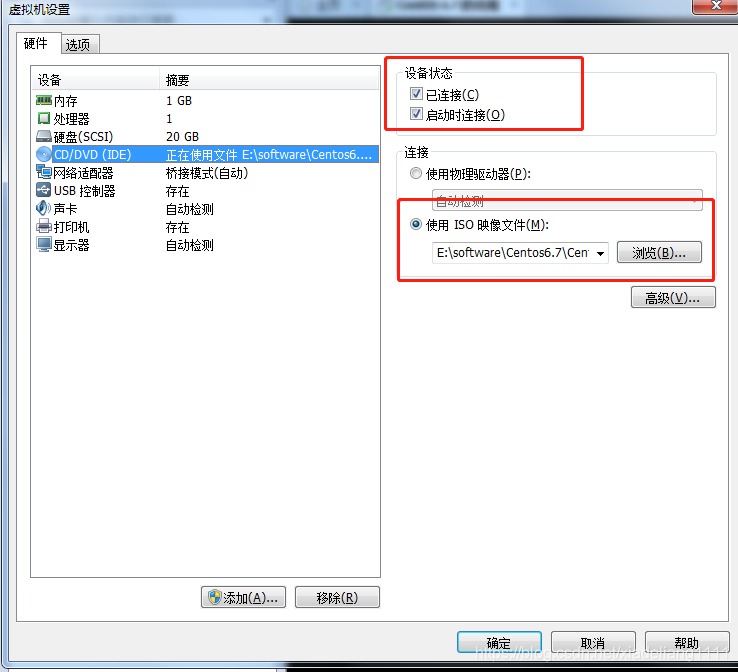
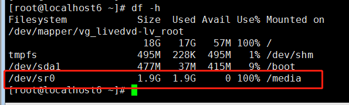
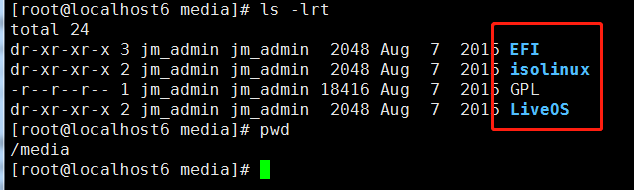

##### 一:基本命令

~~~shell
chmod //改变文件权限（只有超级管理员和所有者才能更改文件的权限）
chown // 改变文件的所有者
chgrp // 改变文件的所属组
usermod -g 组名 用户名 //把一个用户加到一个组里
umask //创建文件的默认属性
ln //创建一个硬链接文件（不能跨设备创建文件）
find //查找文件 -user 按用户查找 -name 按文件名查找 -size 按文件大小查找
find /tmp -cmin -10 //过去10分钟查阅文件
find /tmp -name index* -ecec rm -rf {} /;//查询并删除
locate //索引查询文件 updatedb随时手动更新，但是tmp目录不能被收录
which 指令 //查询指令所在的目录
who //查看当前登录用户
w //查看当前用户和用户正在执行的指令
~~~

##### 二：文件权限

|      | r    | w               | x    |
| ---- | ---- | --------------- | ---- |
| 目录 | ls   | mkdir,rm,cp ,mv | cd   |
| 文件 |      |                 |      |

##### 三：压缩与解压缩

~~~xshell
gzip //压缩文件（不能目录）
gunzip //解压文zip压缩的文件
bzip2 //压缩文件（不能目录）压缩比例更大    -k 保留原文件
bunzip2 //解压bzip2的文件
~~~

1.gzip只能缩文件

2.gzip压缩文件后原文件不存在

3.gzip压缩后缀是【.gz】

~~~xshell
gunzip //解压文件
~~~

~~~xshell
tar 
tar -cvf 打包之后的文件名称 文件目录名称 //打包
gzip 打包之后的文件名称 //压缩
tar -czvf 打包之后的文件名称 文件目录名称 //打包并压缩
tar -zxvf 加压的文件名称 //解压缩，用gzip压缩
tar -jxvf //用bzip2方式解压
tar -jcvf //用bzip2方式压缩
~~~

参数

| tar  |     作用     |
| :--: | :----------: |
|  -c  |     打包     |
|  -v  | 显示压缩过程 |
|  -f  | 指定文件名称 |
|  -z  |  压缩和解压  |
|  -x  |     解包     |

~~~ 
zip 压缩后的文件名称 原文件 //压缩文件后原文件还在
unzip 解压文件 //
~~~

查看当前网络服务

~~~shell
netstat -tlun //查看监听的网络和ip
        -an //查看所有的
traceroute //根据当前的网络地址查询网络ip地址
mail  //
write //
last //查看当前最近登录时间状态
重启服务或者关闭服务器是先关闭服务
~~~

| netstat |                 选项                 |
| :-----: | :----------------------------------: |
|   -t    |       传输控制协议（三次握手）       |
|   -u    | 数据包传输协议（直接将目标发送数据） |
|   -l    |              监听的端口              |
|   -r    |                 路由                 |

计算机三大基石：1.操作系统

​							   2.C语言

​							   3.传输协议

tcp：数据传输稳定

​		  需要建立三次握手机制，效率低

udp:

​		数据不完整

##### 四：硬盘挂载

###### 第一种方式

1、打开虚拟机设置，将ISO镜像文件加载到CD/DVD中，设备状态选中已连接、启动时连接。

2、挂载镜像到/media文件夹下

​		mount  /dev/cdrom  /media/

​		mount -t iso9660  /dev/cdrom(软链接到sr0)  /media/

挂载好后，df -h查看时会多出一个盘符

 

3、进入/media目录，查看文件

此时，就可从查看到挂载的iso镜像中的文件。

 4、卸载目录

​		umount /dev/cdrom

卸载完成后，使用命令df -h就查看不到/media的盘符。

 

###### 第二种方式

1、将镜像文件拷贝到linux系统上。

2、执行命令：mount -o loop /root/xxx.iso /media

3、查看/media文件夹，即可查看到镜像的文件。

4、卸载：umount /media

##### 五：编辑器

三个模式：插入模式，命令模式，编辑模式

插入模式：a A I i o O

编辑模式：u	撤销

​					yy 复制当前行

​					p 粘贴

​					$ 回到行尾

​					0  回到行首

命令模式：

​			set nu 	开启行号

​			:/ 			查找字符

##### 六：linux服务软件的安装模式：

二进制安装-------rpm安装 （红帽系列）   ------------系统默认安装	

源码包安装

**二进制安装优缺点**：

**优点**：

1.不需编译，直接安装，效率高

2.通过指令直接执行就可以安装

**缺点：**

1.安装过程需要依赖包，安r装过程依赖模块（如果安装需要依赖到www.rpmfind.net 查找模块依赖rpm包）

rpm包安装的依赖关系

**线性依赖关系**

a-->b-->c-->d（从后往前安装）

被依赖包安装顺序：从被依赖包依次安装，安装完成后不清楚软件软件包中间还要那些被依赖的包，这个时候把a安装包重新安装一次

**环形依赖关系**

a-->b-->c-->a

一起安装

**模块依赖关系**

到指定网站查相关模块

2.不能看到源码

**源码包安装优缺点：**

**优点**

可以看到源代码，源代码开放，二次开放

可以对代码进行裁剪

软件服务搭建非常干净，清洁，指定特定的目录

**缺点**

需要手动编译

编译的时间较长

编译的过程出现的错误难以解决

**脚本安装**（可视化，适应与不了解linux）

rpm包安装时

​	包全名：未安装软件使用包全名

​	httpd-2.2.15-15.e16.centos.li686.rpm

​	httpd:包名

​	2.2.15 ：版本号

​	15：发行次数

​	e16.centos：适应的软件平台

​	i686:硬件平台

​	rpm：rpm后缀

​	包名：已安装软件使用全名

**对于大型web架构：主包使用源代码包安装，次包使用rpm安装**

​									**gcc使用yum安装**

安装搭建一个apache的web服务

第一步	： 	安装apache,使用光盘安装

​							挂载光盘

​							挂载点：/media/cdrom

第二步	：	进入到关盘中的package安装rpm包

​					rpm -ivh 包全名

​							-i 安装

​							-v 显示安装过程

​							-h 进度

第三步	：	开启服务

第四步	：	访问服务

/var/