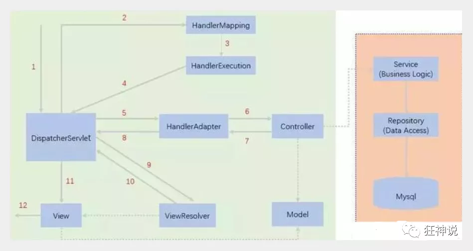

#### 一：概述SpringMVC

- MVC是模型(Model)、视图(View)、控制器(Controller)的简写，是一种软件设计规范。

- 是将业务逻辑、数据、显示分离的方法来组织代码。

- MVC主要作用是**降低了视图与业务逻辑间的双向偶合**。

- MVC不是一种设计模式，**MVC是一种架构模式**。当然不同的MVC存在差异。

  

- **Model（模型）：**数据模型，提供要展示的数据，因此包含数据和行为，可以认为是领域模型或JavaBean组件（包含数据和行为），不过现在一般都分离开来：Value Object（数据Dao） 和 服务层（行为Service）。也就是模型提供了模型数据查询和模型数据的状态更新等功能，包括数据和业务。

  **View（视图）：**负责进行模型的展示，一般就是我们见到的用户界面，客户想看到的东西。

  **Controller（控制器）：**接收用户请求，委托给模型进行处理（状态改变），处理完毕后把返回的模型数据返回给视图，由视图负责展示。也就是说控制器做了个调度员的工作。

##### 1.容易出现404的问题

 查看控制台输出，看一下是不是缺少了什么jar包。

 如果jar包存在，显示无法输出，就在IDEA的项目发布中，添加lib依      赖！

重启Tomcat 即可解决！

##### 2.Springmvc的原理



使用springMVC必须配置的三大件：

**处理器映射器、处理器适配器、视图解析器**

###### SpringMVC的配置文件

~~~xml
<?xml version="1.0" encoding="UTF-8"?>
<beans xmlns="http://www.springframework.org/schema/beans"
      xmlns:xsi="http://www.w3.org/2001/XMLSchema-instance"
      xmlns:context="http://www.springframework.org/schema/context"
      xmlns:mvc="http://www.springframework.org/schema/mvc"
      xsi:schemaLocation="http://www.springframework.org/schema/beans
       http://www.springframework.org/schema/beans/spring-beans.xsd
       http://www.springframework.org/schema/context
       https://www.springframework.org/schema/context/spring-context.xsd
       http://www.springframework.org/schema/mvc
       https://www.springframework.org/schema/mvc/spring-mvc.xsd">

   <!-- 自动扫描包，让指定包下的注解生效,由IOC容器统一管理 -->
   <context:component-scan base-package="com.kuang.controller"/>
   <!-- 让Spring MVC不处理静态资源 -->
   <mvc:default-servlet-handler />
   <!--
   支持mvc注解驱动
       在spring中一般采用@RequestMapping注解来完成映射关系
       要想使@RequestMapping注解生效
       必须向上下文中注册DefaultAnnotationHandlerMapping
       和一个AnnotationMethodHandlerAdapter实例
       这两个实例分别在类级别和方法级别处理。
       而annotation-driven配置帮助我们自动完成上述两个实例的注入。
    -->
   <mvc:annotation-driven />

   <!-- 视图解析器 -->
   <bean class="org.springframework.web.servlet.view.InternalResourceViewResolver"
         id="internalResourceViewResolver">
       <!-- 前缀 -->
       <property name="prefix" value="/WEB-INF/jsp/" />
       <!-- 后缀 -->
       <property name="suffix" value=".jsp" />
   </bean>

</beans>
~~~

###### 配置SpringMVC的web.xml文件

~~~xml

<?xml version="1.0" encoding="UTF-8"?>
<web-app xmlns="http://xmlns.jcp.org/xml/ns/javaee"
        xmlns:xsi="http://www.w3.org/2001/XMLSchema-instance"
        xsi:schemaLocation="http://xmlns.jcp.org/xml/ns/javaee http://xmlns.jcp.org/xml/ns/javaee/web-app_4_0.xsd"
        version="4.0">

   <!--1.注册servlet-->
   <servlet>
       <servlet-name>SpringMVC</servlet-name>
       <servlet-class>org.springframework.web.servlet.DispatcherServlet</servlet-class>
       <!--通过初始化参数指定SpringMVC配置文件的位置，进行关联-->
       <init-param>
           <param-name>contextConfigLocation</param-name>
           <param-value>classpath:springmvc-servlet.xml</param-value>
       </init-param>
       <!-- 启动顺序，数字越小，启动越早 -->
       <load-on-startup>1</load-on-startup>
   </servlet>

   <!--所有请求都会被springmvc拦截 /是匹配除了jsp文件外所有，/*是所有文件-->
   <servlet-mapping>
       <servlet-name>SpringMVC</servlet-name>
       <url-pattern>/</url-pattern>
   </servlet-mapping>
</web-app>
~~~


#### 二：SpringMVC注解

##### 1.**@RequestMapping**

@RequestMapping注解用于映射url到控制器类或一个特定的处理程序方法。可用于类或方法上。用于类上，表示类中的所有响应请求的方法都是以该地址作为父路径。

~~~java
@Controller
public class RestFulController {

   //映射访问路径
   @RequestMapping("/commit/{p1}/{p2}")//@PathVariable 表示取到路径上的参数，通过restfor风格传参，参数必须对应
   public String index(@PathVariable int p1, @PathVariable int p2, Model model){
       
       int result = p1+p2;
       //Spring MVC会自动实例化一个Model对象用于向视图中传值
       model.addAttribute("msg", "结果："+result);
       //返回视图位置
       return "test";
       
  }
   
}
~~~

##### 2.几种常见的注解

~~~java
@GetMapping // @RequestMapping(method =RequestMethod.GET)的快捷方式
@PostMapping
@PutMapping
@DeleteMapping
@PatchMapping
~~~

##### 3.RestFul 风格

**概念**

Restful就是一个资源定位及资源操作的风格。不是标准也不是协议，只是一种风格。基于这个风格设计的软件可以更简洁，更有层次，更易于实现缓存等机制。

**功能**

资源：互联网所有的事物都可以被抽象为资源

资源操作：使用POST、DELETE、PUT、GET，使用不同方法对资源进行操作。

分别对应 添加、 删除、修改、查询。

**传统方式操作资源**  ：通过不同的参数来实现不同的效果！方法单一，post 和 get

​	http://127.0.0.1/item/queryItem.action?id=1 查询,GET

​	http://127.0.0.1/item/saveItem.action 新增,POST

​	http://127.0.0.1/item/updateItem.action 更新,POST

​	http://127.0.0.1/item/deleteItem.action?id=1 删除,GET或POST

**使用RESTful操作资源** ：可以通过不同的请求方式来实现不同的效果！如下：请求地址一样，但是功能可以不同！

​	http://127.0.0.1/item/1 查询,GET

​	http://127.0.0.1/item 新增,POST

​	http://127.0.0.1/item 更新,PUT

​	http://127.0.0.1/item/1 删除,DELETE

##### 4.SpringMVC实现重定向和请求转发

重定向 , 不需要视图解析器 , 本质就是重新请求一个新地方嘛 , 所以注意路径问题.

可以重定向到另外一个请求实现 .

```java
@Controller
public class ResultSpringMVC2 {
   @RequestMapping("/rsm2/t1")
   public String test1(){
       //转发
       return "test";
  }

   @RequestMapping("/rsm2/t2")
   public String test2(){
       //重定向
       return "redirect:/index.jsp";//一定要加一个‘/’
       //return "redirect:hello.do"; //hello.do为另一个请求/
  }

}
```

##### 5.数据处理

###### **1、提交的域名称和处理方法的参数名一致**

提交数据 : http://localhost:8080/hello?name=kuangshen

处理方法 :

```java
@RequestMapping("/hello")
public String hello(String name){
   System.out.println(name);
   return "hello";
}
```

后台输出 : kuangshen


###### **2、提交的域名称和处理方法的参数名不一致**

提交数据 : http://localhost:8080/hello?username=kuangshen

处理方法 :

```java
//@RequestParam("username") : username提交的域的名称 .
@RequestMapping("/hello")
public String hello(@RequestParam("username") String name){//把前端的usernam的值赋给name
   System.out.println(name);
   return "hello";
}
```

后台输出 : kuangshen


###### **3、提交的是一个对象**

要求提交的表单域和对象的属性名一致  , 参数使用对象即可

1、实体类

```java
public class User {
   private int id;
   private String name;
   private int age;
   //构造
   //get/set
   //tostring()
}
```

2、提交数据 : http://localhost:8080/mvc04/user?name=kuangshen&id=1&age=15

3、处理方法 :

```Java
@RequestMapping("/user")
public String user(User user){
   System.out.println(user);
   return "hello";
}
```

后台输出 : User { id=1, name='kuangshen', age=15 }

**说明：如果使用对象的话，前端传递的参数名和对象名必须一致，否则就是null。**

###### 4.数据显示到前端

就对于新手而言简单来说使用区别就是：

```java
Model //只有寥寥几个方法只适合用于储存数据，简化了新手对于Model对象的操作和理解；

ModelMap //继承了 LinkedMap ，除了实现了自身的一些方法，同样的继承 LinkedMap 的方法和特性；

ModelAndView //可以在储存数据的同时，可以进行设置返回的逻辑视图，进行控制展示层的跳转。
```

当然更多的以后开发考虑的更多的是性能和优化，就不能单单仅限于此的了解。

**请使用80%的时间打好扎实的基础，剩下18%的时间研究框架，2%的时间去学点英文，框架的官方文档永远是最好的教程。**

##### 6.乱码问题

以前乱码问题通过过滤器解决 , 而SpringMVC给我们提供了一个过滤器 , 可以在web.xml中配置 .

修改了xml文件需要重启服务器！

```xml
<filter>
   <filter-name>encoding</filter-name>
   <filter-class>org.springframework.web.filter.CharacterEncodingFilter</filter-class>
   <init-param>
       <param-name>encoding</param-name>
       <param-value>utf-8</param-value>
   </init-param>
</filter>
<filter-mapping>
   <filter-name>encoding</filter-name>
   <url-pattern>/*</url-pattern>
</filter-mapping>
```

**只能配置为/***（手动的配置一个过滤器）

自定义写一个过滤器

~~~java
package com.kuang.filter;

import javax.servlet.*;
import javax.servlet.http.HttpServletRequest;
import javax.servlet.http.HttpServletRequestWrapper;
import javax.servlet.http.HttpServletResponse;
import java.io.IOException;
import java.io.UnsupportedEncodingException;
import java.util.Map;

/**
* 解决get和post请求 全部乱码的过滤器
*/
public class GenericEncodingFilter implements Filter {

   @Override
   public void destroy() {
  }

   @Override
   public void doFilter(ServletRequest request, ServletResponse response, FilterChain chain) throws IOException, ServletException {
       //处理response的字符编码
       HttpServletResponse myResponse=(HttpServletResponse) response;
       myResponse.setContentType("text/html;charset=UTF-8");

       // 转型为与协议相关对象
       HttpServletRequest httpServletRequest = (HttpServletRequest) request;
       // 对request包装增强
       HttpServletRequest myrequest = new MyRequest(httpServletRequest);
       chain.doFilter(myrequest, response);
  }

   @Override
   public void init(FilterConfig filterConfig) throws ServletException {
  }

}

//自定义request对象，HttpServletRequest的包装类
class MyRequest extends HttpServletRequestWrapper {

   private HttpServletRequest request;
   //是否编码的标记
   private boolean hasEncode;
   //定义一个可以传入HttpServletRequest对象的构造函数，以便对其进行装饰
   public MyRequest(HttpServletRequest request) {
       super(request);// super必须写
       this.request = request;
  }

   // 对需要增强方法 进行覆盖
   @Override
   public Map getParameterMap() {
       // 先获得请求方式
       String method = request.getMethod();
       if (method.equalsIgnoreCase("post")) {
           // post请求
           try {
               // 处理post乱码
               request.setCharacterEncoding("utf-8");
               return request.getParameterMap();
          } catch (UnsupportedEncodingException e) {
               e.printStackTrace();
          }
      } else if (method.equalsIgnoreCase("get")) {
           // get请求
           Map<String, String[]> parameterMap = request.getParameterMap();
           if (!hasEncode) { // 确保get手动编码逻辑只运行一次
               for (String parameterName : parameterMap.keySet()) {
                   String[] values = parameterMap.get(parameterName);
                   if (values != null) {
                       for (int i = 0; i < values.length; i++) {
                           try {
                               // 处理get乱码
                               values[i] = new String(values[i]
                                      .getBytes("ISO-8859-1"), "utf-8");
                          } catch (UnsupportedEncodingException e) {
                               e.printStackTrace();
                          }
                      }
                  }
              }
               hasEncode = true;
          }
           return parameterMap;
      }
       return super.getParameterMap();
  }

   //取一个值
   @Override
   public String getParameter(String name) {
       Map<String, String[]> parameterMap = getParameterMap();
       String[] values = parameterMap.get(name);
       if (values == null) {
           return null;
      }
       return values[0]; // 取回参数的第一个值
  }

   //取所有值
   @Override
   public String[] getParameterValues(String name) {
       Map<String, String[]> parameterMap = getParameterMap();
       String[] values = parameterMap.get(name);
       return values;
  }
}
~~~

#### 三：SSM的整合

##### 1.web项目的包

~~~xml
<dependencies>
        <!--Junit-->
        <dependency>
            <groupId>junit</groupId>
            <artifactId>junit</artifactId>
            <version>4.12</version>
        </dependency>
        <!--数据库驱动-->
        <dependency>
            <groupId>mysql</groupId>
            <artifactId>mysql-connector-java</artifactId>
            <version>5.1.47</version>
        </dependency>
        <!-- 数据库连接池 -->
        <dependency>
            <groupId>com.mchange</groupId>
            <artifactId>c3p0</artifactId>
            <version>0.9.5.2</version>
        </dependency>

        <!--Servlet - JSP -->
        <dependency>
            <groupId>javax.servlet</groupId>
            <artifactId>servlet-api</artifactId>
            <version>2.5</version>
        </dependency>
        <dependency>
            <groupId>javax.servlet.jsp</groupId>
            <artifactId>jsp-api</artifactId>
            <version>2.2</version>
        </dependency>
        <dependency>
            <groupId>javax.servlet</groupId>
            <artifactId>jstl</artifactId>
            <version>1.2</version>
        </dependency>

        <!--Mybatis-->
        <dependency>
            <groupId>org.mybatis</groupId>
            <artifactId>mybatis</artifactId>
            <version>3.5.2</version>
        </dependency>
        <dependency>
            <groupId>org.mybatis</groupId>
            <artifactId>mybatis-spring</artifactId>
            <version>2.0.2</version>
        </dependency>

        <!--Spring-->
        <dependency>
            <groupId>org.springframework</groupId>
            <artifactId>spring-webmvc</artifactId>
            <version>5.1.9.RELEASE</version>
        </dependency>
        <dependency>
            <groupId>org.springframework</groupId>
            <artifactId>spring-jdbc</artifactId>
            <version>5.1.9.RELEASE</version>
        </dependency>
        <!--AOP的包-->
        <dependency>
            <groupId>org.aspectj</groupId>
            <artifactId>aspectjweaver</artifactId>
            <version>1.9.6</version>
        </dependency>
        <dependency>
            <groupId>org.projectlombok</groupId>
            <artifactId>lombok</artifactId>
            <version>1.18.12</version>
        </dependency>
    </dependencies>
~~~

##### 2.静态资源过滤

~~~xml
<build>
        <resources>
            <resource>
                <directory>src/main/java</directory>
                <includes>
                    <include>**/*.properties</include>
                    <include>**/*.xml</include>
                </includes>
                <filtering>false</filtering>
            </resource>
            <resource>
                <directory>src/main/resources</directory>
                <includes>
                    <include>**/*.properties</include>
                    <include>**/*.xml</include>
                </includes>
                <filtering>false</filtering>
            </resource>
        </resources>
    </build>
~~~

##### 3.Mybaties层的编写

###### 1.数据库配置文件

~~~properties
jdbc.driver=com.mysql.jdbc.Driver
jdbc.url=jdbc:mysql://localhost:3306/ssm?useSSL=true&useUnicode=true&characterEncoding=utf8
jdbc.username=root
jdbc.password=123456
~~~

###### 2.mybatis-comfig的配置文件

~~~xml
<?xml version="1.0" encoding="UTF-8" ?>
<!DOCTYPE configuration
        PUBLIC "-//mybatis.org//DTD Config 3.0//EN"
        "http://mybatis.org/dtd/mybatis-3-config.dtd">
<configuration>

    <typeAliases>
        <package name="com.dai.pojo"/>
    </typeAliases>
    <mappers>
        <mapper resource="com/dai/mapper/BookMapper.xml"/>
    </mappers>
</configuration>
~~~

**【写完一个mapper一定要首先注册】**

###### 3.pojo实体类的编写

###### 4.mapper接口的编写

~~~java
public interface BookMapper {

   //增加一个Book
   int addBook(Books book);

   //根据id删除一个Book
   int deleteBookById(int id);

   //更新Book
   int updateBook(Books books);

   //根据id查询,返回一个Book
   Books queryBookById(int id);

   //查询全部Book,返回list集合
   List<Books> queryAllBook();

}
~~~


###### 5.mapper.xml的编写

~~~xml
<?xml version="1.0" encoding="UTF-8" ?>
<!DOCTYPE mapper
        PUBLIC "-//mybatis.org//DTD Config 3.0//EN"
        "http://mybatis.org/dtd/mybatis-3-mapper.dtd">

<mapper namespace="com.dai.mapper.BookMapper">
    <insert id="addBook" parameterType="Book">
      insert into books(name,counts,detail)
      values (#{name}, #{counts}, #{detail})
   </insert>

    <!--根据id删除一个Book-->
    <delete id="deleteBookById" parameterType="int">
      delete from books where id=#{id}
   </delete>

    <!--更新Book-->
    <update id="updateBook" parameterType="Book">
      update books
      set name = #{name},counts = #{counts},detail = #{detail}
      where id = #{id}
   </update>

    <!--根据id查询,返回一个Book-->
    <select id="queryBookById" resultType="Book">
      select * from books
      where id = #{id}
   </select>

    <!--查询全部Book-->
    <select id="queryAllBook" resultType="Book">
      SELECT * from books
   </select>
</mapper>
~~~

**【mapper写完第一时间注册】**

###### 6.Service层调用mapper层

**接口**

~~~java
public interface BookService {
   //增加一个Book
   int addBook(Books book);
   //根据id删除一个Book
   int deleteBookById(int id);
   //更新Book
   int updateBook(Books books);
   //根据id查询,返回一个Book
   Books queryBookById(int id);
   //查询全部Book,返回list集合
   List<Books> queryAllBook();
}
~~~

**实现层**【**service调用mapper，controller调用service**】

~~~java
public class BookServiceImpl implements BookService {

   //调用dao层的操作，设置一个set接口，方便Spring管理
   private BookMapper bookMapper;

   public void setBookMapper(BookMapper bookMapper) {
       this.bookMapper = bookMapper;
  }
   
   public int addBook(Books book) {
       return bookMapper.addBook(book);
  }
   
   public int deleteBookById(int id) {
       return bookMapper.deleteBookById(id);
  }
   
   public int updateBook(Books books) {
       return bookMapper.updateBook(books);
  }
   
   public Books queryBookById(int id) {
       return bookMapper.queryBookById(id);
  }
   
   public List<Books> queryAllBook() {
       return bookMapper.queryAllBook();
  }
}
~~~

##### 4.Spring-Mybaties的编写

###### 1.Spring-Mapper的整合

~~~xml
<?xml version="1.0" encoding="UTF-8"?>
<beans xmlns="http://www.springframework.org/schema/beans"
       xmlns:xsi="http://www.w3.org/2001/XMLSchema-instance"
       xmlns:context="http://www.springframework.org/schema/context"
       xsi:schemaLocation="http://www.springframework.org/schema/beans
       http://www.springframework.org/schema/beans/spring-beans.xsd
       http://www.springframework.org/schema/context
       https://www.springframework.org/schema/context/spring-context.xsd">

    <!-- 配置整合mybatis -->
    <!-- 1.关联数据库文件 -->
    <context:property-placeholder location="classpath:database.properties"/>

    <!-- 2.数据库连接池 -->
    <!--数据库连接池
        dbcp 半自动化操作 不能自动连接
        c3p0 自动化操作（自动的加载配置文件 并且设置到对象里面）
    -->
    <bean id="dataSource" class="com.mchange.v2.c3p0.ComboPooledDataSource">
        <!-- 配置连接池属性 -->
        <property name="driverClass" value="${jdbc.driver}"/>
        <property name="jdbcUrl" value="${jdbc.url}"/>
        <property name="user" value="${jdbc.username}"/>
        <property name="password" value="${jdbc.password}"/>

        <!-- c3p0连接池的私有属性 -->
        <property name="maxPoolSize" value="30"/>
        <property name="minPoolSize" value="10"/>
        <!-- 关闭连接后不自动commit -->
        <property name="autoCommitOnClose" value="false"/>
        <!-- 获取连接超时时间 -->
        <property name="checkoutTimeout" value="10000"/>
        <!-- 当获取连接失败重试次数 -->
        <property name="acquireRetryAttempts" value="2"/>
    </bean>

    <!-- 3.配置SqlSessionFactory对象 -->
    <bean id="sqlSessionFactory" class="org.mybatis.spring.SqlSessionFactoryBean">
        <!-- 注入数据库连接池 -->
        <property name="dataSource" ref="dataSource"/>
        <!-- 配置MyBaties全局配置文件:mybatis-config.xml -->
        <property name="configLocation" value="classpath:mybatis-config.xml"/>
    </bean>

    <!-- 4.配置扫描Dao接口包，动态实现Dao接口注入到spring容器中 -->
    <!--解释 ：https://www.cnblogs.com/jpfss/p/7799806.html-->
    <bean class="org.mybatis.spring.mapper.MapperScannerConfigurer">
        <!-- 注入sqlSessionFactory -->
        <property name="sqlSessionFactoryBeanName" value="sqlSessionFactory"/>
        <!-- 给出需要扫描Dao接口包 -->
        <property name="basePackage" value="com.dai.mapper"/>
    </bean>

</beans>
~~~

**【设置自动扫描接口包】**

###### 2.Spring-Service整合

~~~xml
<?xml version="1.0" encoding="UTF-8"?>
<beans xmlns="http://www.springframework.org/schema/beans"
       xmlns:xsi="http://www.w3.org/2001/XMLSchema-instance"
       xmlns:context="http://www.springframework.org/schema/context"
       xsi:schemaLocation="http://www.springframework.org/schema/beans
   http://www.springframework.org/schema/beans/spring-beans.xsd
   http://www.springframework.org/schema/context
   http://www.springframework.org/schema/context/spring-context.xsd">

    <!-- 扫描service相关的bean -->
    <context:component-scan base-package="com.dai.service" />

    <!--BookServiceImpl注入到IOC容器中-->
    <bean id="bookServiceImp" class="com.dai.service.BookServiceImp">
        <property name="bookMapper" ref="bookMapper"/>
    </bean>

    <!-- 配置事务管理器 -->
    <bean id="transactionManager" class="org.springframework.jdbc.datasource.DataSourceTransactionManager">
        <!-- 注入数据库连接池 -->
        <property name="dataSource" ref="dataSource" />
    </bean>

</beans>
~~~

##### 5.SpringMVC的整合

###### 1.web.xml的编写

~~~xml
<?xml version="1.0" encoding="UTF-8"?>
<web-app xmlns="http://xmlns.jcp.org/xml/ns/javaee"
         xmlns:xsi="http://www.w3.org/2001/XMLSchema-instance"
         xsi:schemaLocation="http://xmlns.jcp.org/xml/ns/javaee http://xmlns.jcp.org/xml/ns/javaee/web-app_4_0.xsd"
         version="4.0">

    <!--DispatcherServlet-->
    <servlet>
        <servlet-name>DispatcherServlet</servlet-name>
        <servlet-class>org.springframework.web.servlet.DispatcherServlet</servlet-class>
        <init-param>
            <param-name>contextConfigLocation</param-name>
            <!--一定要注意:我们这里加载的是总的配置文件，之前被这里坑了！-->
            <param-value>classpath:applicationContext.xml</param-value>
        </init-param>
        <load-on-startup>1</load-on-startup>
    </servlet>
    <servlet-mapping>
        <servlet-name>DispatcherServlet</servlet-name>
        <url-pattern>/</url-pattern>
    </servlet-mapping>

    <!--encodingFilter-->
    <filter>
        <filter-name>encodingFilter</filter-name>
        <filter-class>
            org.springframework.web.filter.CharacterEncodingFilter
        </filter-class>
        <init-param>
            <param-name>encoding</param-name>
            <param-value>utf-8</param-value>
        </init-param>
    </filter>
    <filter-mapping>
        <filter-name>encodingFilter</filter-name>
        <url-pattern>/*</url-pattern>
    </filter-mapping>

    <!--Session过期时间-->
    <session-config>
        <session-timeout>15</session-timeout>
    </session-config>

</web-app>
~~~

2.Spring-MVC的整合

~~~xml
<?xml version="1.0" encoding="UTF-8"?>
<beans xmlns="http://www.springframework.org/schema/beans"
      xmlns:xsi="http://www.w3.org/2001/XMLSchema-instance"
      xmlns:context="http://www.springframework.org/schema/context"
      xmlns:mvc="http://www.springframework.org/schema/mvc"
      xsi:schemaLocation="http://www.springframework.org/schema/beans
   http://www.springframework.org/schema/beans/spring-beans.xsd
   http://www.springframework.org/schema/context
   http://www.springframework.org/schema/context/spring-context.xsd
   http://www.springframework.org/schema/mvc
   https://www.springframework.org/schema/mvc/spring-mvc.xsd">

   <!-- 配置SpringMVC -->
   <!-- 1.开启SpringMVC注解驱动 -->
   <mvc:annotation-driven />
   <!-- 2.静态资源默认servlet配置-->
   <mvc:default-servlet-handler/>

   <!-- 3.配置jsp 显示ViewResolver视图解析器 -->
   <bean class="org.springframework.web.servlet.view.InternalResourceViewResolver">
       <property name="viewClass" value="org.springframework.web.servlet.view.JstlView" />
       <property name="prefix" value="/WEB-INF/jsp/" />
       <property name="suffix" value=".jsp" />
   </bean>

   <!-- 4.扫描web相关的bean -->
   <context:component-scan base-package="com.kuang.controller" />

</beans>
~~~

##### 6.Spring配置文件的大整合

###### **applicationContext.xml**的整合

~~~xml
<?xml version="1.0" encoding="UTF-8"?>
<beans xmlns="http://www.springframework.org/schema/beans"
      xmlns:xsi="http://www.w3.org/2001/XMLSchema-instance"
      xsi:schemaLocation="http://www.springframework.org/schema/beans
       http://www.springframework.org/schema/beans/spring-beans.xsd">

   <import resource="spring-dao.xml"/>
   <import resource="spring-service.xml"/>
   <import resource="spring-mvc.xml"/>
   
</beans>
~~~

#### 四:  MVC的其他技术

##### 1.前端小技巧

~~~html
pageContext.request.contextPath //获取当前项目绝对路径（字符串）
~~~

##### 2.Json技术

###### 1.JSON 和 JavaScript 对象互转

要实现从JSON字符串转换为JavaScript 对象，使用 JSON.parse() 方法：

```html
var obj = JSON.parse('{"a": "Hello", "b": "World"}');
//结果是 {a: 'Hello', b: 'World'}
```

要实现从JavaScript 对象转换为JSON字符串，使用 JSON.stringify() 方法：

```jsp
var json = JSON.stringify({a: 'Hello', b: 'World'});
//结果是 '{"a": "Hello", "b": "World"}'

```

Java使用json要导入工具包依赖

~~~xml
<dependency>
   <groupId>com.fasterxml.jackson.core</groupId>
   <artifactId>jackson-databind</artifactId>
   <version>2.9.8</version>
</dependency>
~~~

###### 2.乱码问题的解决

通过@RequestMaping的produces属性来实现，修改下代码

```java
//produces:指定响应体返回类型和编码
@RequestMapping(value = "/json1",produces = "application/json;charset=utf-8")
```

2.配置springmvc文件

```xml
<mvc:annotation-driven>
   <mvc:message-converters register-defaults="true">
       <bean class="org.springframework.http.converter.StringHttpMessageConverter">
           <constructor-arg value="UTF-8"/>
       </bean>
       <bean class="org.springframework.http.converter.json.MappingJackson2HttpMessageConverter">
           <property name="objectMapper">
               <bean class="org.springframework.http.converter.json.Jackson2ObjectMapperFactoryBean">
                   <property name="failOnEmptyBeans" value="false"/>
               </bean>
           </property>
       </bean>
   </mvc:message-converters>
</mvc:annotation-driven>
```

##### 3.Ajax技术

###### 1.简介

- **AJAX = Asynchronous JavaScript and XML（异步的 JavaScript 和 XML）。**

- AJAX 是一种在无需重新加载整个网页的情况下，能够更新部分网页的技术。

- **Ajax 不是一种新的编程语言，而是一种用于创建更好更快以及交互性更强的Web应用程序的技术。**

  

###### 2.案例1

Ajax最重要的三要素：url一个请求（利用controller完成），data（携带数据，与后端的字段要相同，

否则要加相应的注解，可以省略）success(事件成功之后的回调，是一个函数，与之相对应的error)

~~~jsp
<%@ page contentType="text/html;charset=UTF-8" language="java" %>
<html>
 <head>
   <title>$Title$</title>
  <%--<script src="https://code.jquery.com/jquery-3.1.1.min.js"></script>--%>
   <script src="${pageContext.request.contextPath}/statics/js/jquery-3.1.1.min.js"></script>
   <script>
       function a1(){
           $.post({
               url:"${pageContext.request.contextPath}/a1",
               data:{'name':$("#txtName").val()},
               success:function (data,status) {
                   alert(data);
                   alert(status);
              }
          });
      }
   </script>
 </head>
 <body>

<%--onblur：失去焦点触发事件--%>
用户名:<input type="text" id="txtName" onblur="a1()"/>

 </body>
</html>
~~~

###### 3.优缺点

1) 没有浏览历史，不能回退 

2) 存在跨域问题(同源) 

3) SEO 不友好

###### 4.案例2

后端代码

~~~java
@RequestMapping("/a3")
public String ajax3(String name,String pwd){
   String msg = "";
   //模拟数据库中存在数据
   if (name!=null){
       if ("admin".equals(name)){
           msg = "OK";
      }else {
           msg = "用户名输入错误";
      }
  }
   if (pwd!=null){
       if ("123456".equals(pwd)){
           msg = "OK";
      }else {
           msg = "密码输入有误";
      }
  }
   return msg; //由于@RestController注解，将msg转成json格式返回
}
~~~

前端代码

~~~jsp
<%@ page contentType="text/html;charset=UTF-8" language="java" %>
<html>
<head>
   <title>ajax</title>
   <script src="${pageContext.request.contextPath}/statics/js/jquery-3.1.1.min.js"></script>
   <script>

       function a1(){
           $.post({
               url:"${pageContext.request.contextPath}/a3",
               data:{'name':$("#name").val()},
               success:function (data) {
                   if (data.toString()=='OK'){
                       $("#userInfo").css("color","green");
                  }else {
                       $("#userInfo").css("color","red");
                  }
                   $("#userInfo").html(data);
              }
          });
      }
       function a2(){
           $.post({
               url:"${pageContext.request.contextPath}/a3",
               data:{'pwd':$("#pwd").val()},
               success:function (data) {
                   if (data.toString()=='OK'){
                       $("#pwdInfo").css("color","green");
                  }else {
                       $("#pwdInfo").css("color","red");
                  }
                   $("#pwdInfo").html(data);
              }
          });
      }

   </script>
</head>
<body>
<p>
  用户名:<input type="text" id="name" onblur="a1()"/>
   <span id="userInfo"></span>
</p>
<p>
  密码:<input type="text" id="pwd" onblur="a2()"/>
   <span id="pwdInfo"></span>
</p>
</body>
</html>
~~~

##### 4.拦截器

###### 1.概述

SpringMVC的处理器拦截器类似于Servlet开发中的过滤器Filter,用于对处理器进行预处理和后处理。开发者可以自己定义一些拦截器来实现特定的功能。

过滤器与拦截器的区别：

**过滤器**

1.servlet规范中的一部分，任何java web工程都可以使用

2.在url-pattern中配置了/*之后，可以对所有要访问的资源进行拦截

**拦截器**

1.拦截器是SpringMVC框架自己的，只有使用了SpringMVC框架的工程才能使用

2.拦截器只会拦截访问的控制器方法， 如果访问的是jsp/html/css/image/js是不会进行拦截的


###### 2.实现拦截器

想要自定义拦截器，必须实现 HandlerInterceptor 接口。

1、新建一个Moudule ， springmvc-07-Interceptor  ， 添加web支持

2、配置web.xml 和 springmvc-servlet.xml 文件

3、编写一个拦截器

~~~java
package com.kuang.interceptor;

import org.springframework.web.servlet.HandlerInterceptor;
import org.springframework.web.servlet.ModelAndView;

import javax.servlet.http.HttpServletRequest;
import javax.servlet.http.HttpServletResponse;

public class MyInterceptor implements HandlerInterceptor {

   //在请求处理的方法之前执行
   //如果返回true执行下一个拦截器
   //如果返回false就不执行下一个拦截器
   public boolean preHandle(HttpServletRequest httpServletRequest, HttpServletResponse httpServletResponse, Object o) throws Exception {
       System.out.println("------------处理前------------");
       return true;
  }

   //在请求处理方法执行之后执行
   public void postHandle(HttpServletRequest httpServletRequest, HttpServletResponse httpServletResponse, Object o, ModelAndView modelAndView) throws Exception {
       System.out.println("------------处理后------------");
  }

   //在dispatcherServlet处理后执行,做清理工作.
   public void afterCompletion(HttpServletRequest httpServletRequest, HttpServletResponse httpServletResponse, Object o, Exception e) throws Exception {
       System.out.println("------------清理------------");
  }
}
~~~

在SpringMVC配置拦截器

~~~xml
<!--关于拦截器的配置-->
<mvc:interceptors>
   <mvc:interceptor>
       <!--/** 包括路径及其子路径-->
       <!--/admin/* 拦截的是/admin/add等等这种 , /admin/add/user不会被拦截-->
       <!--/admin/** 拦截的是/admin/下的所有-->
       <mvc:mapping path="/**"/>
       <!--bean配置的就是拦截器-->
       <bean class="com.kuang.interceptor.MyInterceptor"/>
   </mvc:interceptor>
</mvc:interceptors>
~~~

##### 5.文件的上传和下载

**前端表单要求**：为了能上传文件，必须将表单的method设置为POST，并将enctype设置为multipart/form-data。只有在这样的情况下，浏览器才会把用户选择的文件以二进制数据发送给服务器；

- application/x-www=form-urlencoded：默认方式，只处理表单域中的 value 属性值，采用这种编码方式的表单会将表单域中的值处理成 URL 编码方式。
- multipart/form-data：这种编码方式会以二进制流的方式来处理表单数据，这种编码方式会把文件域指定文件的内容也封装到请求参数中，不会对字符编码。
- text/plain：除了把空格转换为 "+" 号外，其他字符都不做编码处理，这种方式适用直接通过表单发送邮件。

###### 1、导入文件上传的jar包

commons-fileupload ， Maven会自动帮我们导入他的依赖包 commons-io包:

```xml
<!--文件上传-->
<dependency>
   <groupId>commons-fileupload</groupId>
   <artifactId>commons-fileupload</artifactId>
   <version>1.3.3</version>
</dependency>
<!--servlet-api导入高版本的-->
<dependency>
   <groupId>javax.servlet</groupId>
   <artifactId>javax.servlet-api</artifactId>
   <version>4.0.1</version>
</dependency>
```

###### 2、配置bean：multipartResolver

【**注意！！！这个bena的id必须为：multipartResolver ， 否则上传文件会报400的错误！在这里栽过坑,教训！**】

```xml
<!--文件上传配置-->
<bean id="multipartResolver"  class="org.springframework.web.multipart.commons.CommonsMultipartResolver">
   <!-- 请求的编码格式，必须和jSP的pageEncoding属性一致，以便正确读取表单的内容，默认为ISO-8859-1 -->
   <property name="defaultEncoding" value="utf-8"/>
   <!-- 上传文件大小上限，单位为字节（10485760=10M） -->
   <property name="maxUploadSize" value="10485760"/>
   <property name="maxInMemorySize" value="40960"/>
</bean>
```

###### 3.文件上传的第一种方式

~~~java
package com.kuang.controller;

import org.springframework.stereotype.Controller;
import org.springframework.web.bind.annotation.RequestMapping;
import org.springframework.web.bind.annotation.RequestParam;
import org.springframework.web.multipart.commons.CommonsMultipartFile;

import javax.servlet.http.HttpServletRequest;
import java.io.*;

@Controller
public class FileController {
   //@RequestParam("file") 将name=file控件得到的文件封装成CommonsMultipartFile 对象
   //批量上传CommonsMultipartFile则为数组即可
   @RequestMapping("/upload")
   public String fileUpload(@RequestParam("file") CommonsMultipartFile file , HttpServletRequest request) throws IOException {

       //获取文件名 : file.getOriginalFilename();
       String uploadFileName = file.getOriginalFilename();

       //如果文件名为空，直接回到首页！
       if ("".equals(uploadFileName)){
           return "redirect:/index.jsp";
      }
       System.out.println("上传文件名 : "+uploadFileName);

       //上传路径保存设置
       String path = request.getServletContext().getRealPath("/upload");
       //如果路径不存在，创建一个
       File realPath = new File(path);
       if (!realPath.exists()){
           realPath.mkdir();
      }
       System.out.println("上传文件保存地址："+realPath);

       InputStream is = file.getInputStream(); //文件输入流
       OutputStream os = new FileOutputStream(new File(realPath,uploadFileName)); //文件输出流

       //读取写出
       int len=0;
       byte[] buffer = new byte[1024];
       while ((len=is.read(buffer))!=-1){
           os.write(buffer,0,len);
           os.flush();
      }
       os.close();
       is.close();
       return "redirect:/index.jsp";
  }
}
~~~

###### 4.文件上传的第二种方式

~~~java
/*
* 采用file.Transto 来保存上传的文件
*/
@RequestMapping("/upload2")
public String  fileUpload2(@RequestParam("file") CommonsMultipartFile file, HttpServletRequest request) throws IOException {

   //上传路径保存设置
   String path = request.getServletContext().getRealPath("/upload");
   File realPath = new File(path);
   if (!realPath.exists()){
       realPath.mkdir();
  }
   //上传文件地址
   System.out.println("上传文件保存地址："+realPath);

   //通过CommonsMultipartFile的方法直接写文件（注意这个时候）
   file.transferTo(new File(realPath +"/"+ file.getOriginalFilename()));

   return "redirect:/index.jsp";
}
~~~

###### 5，文件下载

~~~java
@RequestMapping(value="/download")
public String downloads(HttpServletResponse response ,HttpServletRequest request) throws Exception{
   //要下载的图片地址
   String  path = request.getServletContext().getRealPath("/upload");
   String  fileName = "基础语法.jpg";

   //1、设置response 响应头
   response.reset(); //设置页面不缓存,清空buffer
   response.setCharacterEncoding("UTF-8"); //字符编码
   response.setContentType("multipart/form-data"); //二进制传输数据
   //设置响应头
   response.setHeader("Content-Disposition",
           "attachment;fileName="+URLEncoder.encode(fileName, "UTF-8"));

   File file = new File(path,fileName);
   //2、 读取文件--输入流
   InputStream input=new FileInputStream(file);
   //3、 写出文件--输出流
   OutputStream out = response.getOutputStream();

   byte[] buff =new byte[1024];
   int index=0;
   //4、执行 写出操作
   while((index= input.read(buff))!= -1){
       out.write(buff, 0, index);
       out.flush();
  }
   out.close();
   input.close();
   return null;
}
~~~

